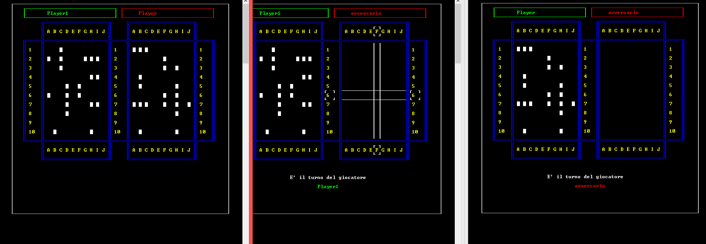
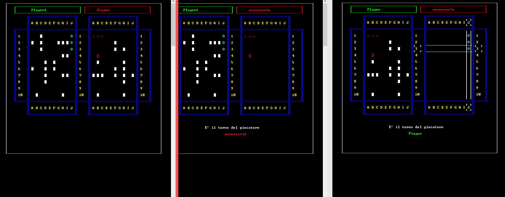
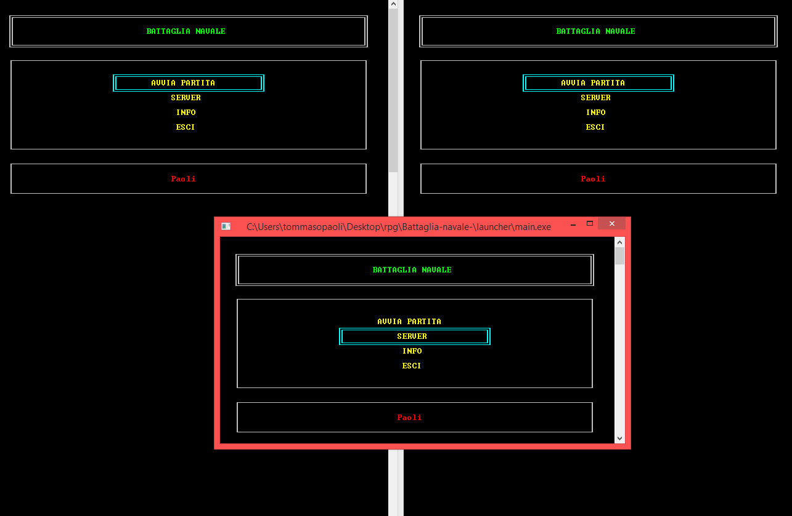

## Compile
add to compiler `-lwsock32`

## Avvio

1. run **battaglia_navale.bat** and select **SERVER**

2. run **battaglia_navale.bat** 2 times and select **AVVIA PARTITA** (you can use the same computer)

3. Client need insert ip of server and a nickname

